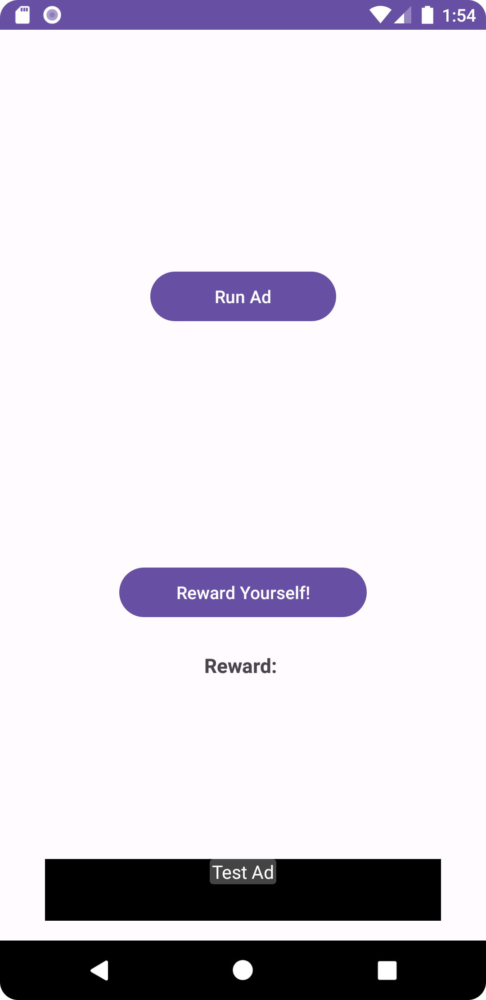
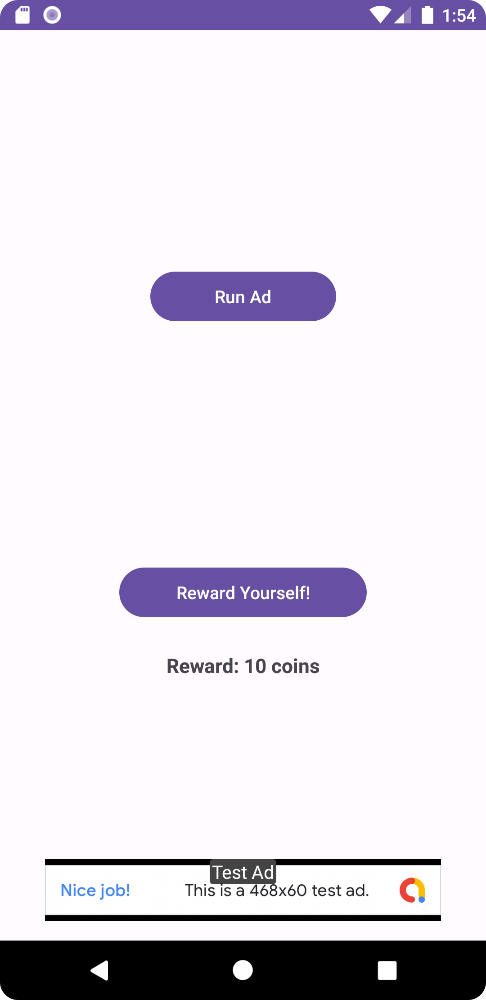
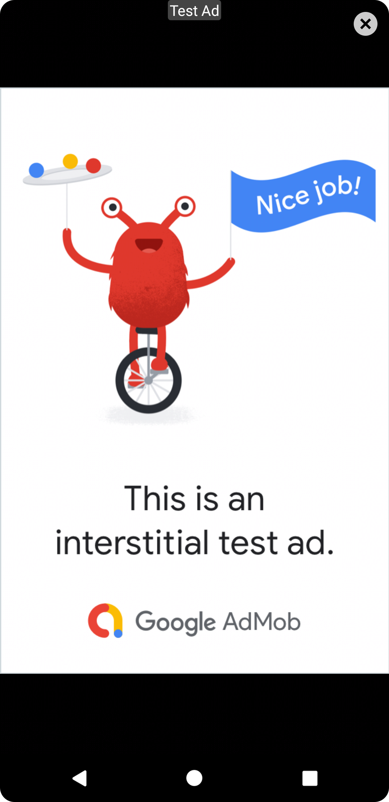
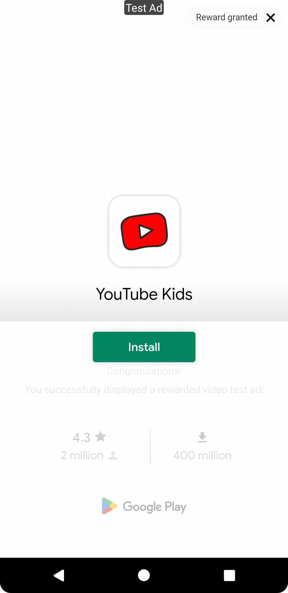

# CoffeeBeans

This Android app demonstrates the integration of various types of Google AdMob ads: Banner Ad, Interstitial Ad, and Rewarded Ad. These ads provide opportunities to monetize your app by displaying advertisements to users.

## Features

### Banner Ad

The app displays a banner ad at the bottom of the "Main" activity. A Google test ad is used to showcase this feature.

### Interstitial Ad

The "Main" activity includes a button that allows users to view an interstitial ad. In a real-world application, you would typically show interstitial ads during natural transitions or pauses in the app. However, in this simplified example, the button serves the purpose of demonstrating how to implement and display interstitial ads.

### Rewarded Ad

The "Main" activity features a button that enables users to view a rewarded ad using a Google test ad. When the user interacts with the rewarded ad and clicks the close button, they will receive a reward. The reward amount and type are displayed in a text field next to the button.

## Getting Started

To run this app and explore the ad integration features, follow these steps:

1. Clone the repository to your local machine.

2. Open the project in Android Studio.

3. Ensure you have the necessary dependencies and the Google AdMob SDK properly configured in your project.

4. Run the app on an Android emulator or a physical device.

5. Navigate to the "Main" activity and explore the different ad types.

## APK File

You can download the APK file of this app from the root directory of this repository. Simply click the following link to download the APK file: [AdIntegrationApp.apk](AdIntegrationApp.apk)

## Screenshots

Here are some screenshots of the app:

- Main activity before showing a rewarded ad:
  

- Main activity after showing a rewarded ad:
  

- Interstitial ad:
  

- Rewarded ad:
  

## AdMob Integration

To integrate your own AdMob ads into this app, follow these steps:

1. Sign up for an AdMob account and create ad units for banner, interstitial, and rewarded ads.

2. Replace the test ad unit IDs in the code with your actual ad unit IDs.

3. Implement the necessary callbacks and handling logic for your specific use case.

4. Test the app with your own ads to ensure proper functionality.

## Disclaimer

This app uses Google test ads to demonstrate ad integration. In a production environment, you should replace the test ad units with your own ad unit IDs and adhere to Google AdMob policies and guidelines.

## Resources

- [Google AdMob](https://admob.google.com)
- [AdMob Documentation](https://developers.google.com/admob)

[//]: # (Used ChatGPT to generate this README.)

Feel free to explore, modify, and use this app as a reference for integrating AdMob ads into your own Android applications. Happy coding!
